# AI-Powered Parametric Micro-Insurance for Gig Workers

# Problem Statement

India’s gig economy has grown rapidly with millions of workers working as delivery partners for platforms like Zomato, Swiggy, Amazon, and Zepto. These gig workers rely heavily on daily or weekly earnings for their livelihood.
External disruptions such as heavy rain, heatwaves and natural disasters often reduce delivery demand or make it unsafe for workers to operate. As a result, many gig workers lose around 20–30% of their weekly income.
Most gig workers do not have income protection or insurance that compensates them for lost earnings during these disruptions. Traditional insurance solutions are complex and not designed for gig workers.
This creates a need for an AI-powered parametric insurance system that can automatically detect disruptions and provide quick payouts to gig workers. 
Visual Representation of the Problem:  
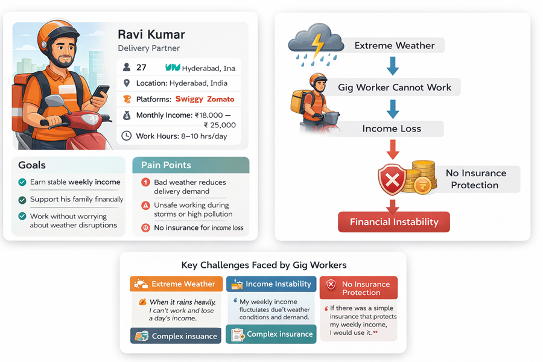

# User Persona
To better understand the challenges faced by gig workers, we conducted informal interviews and discussions with delivery partners working on platforms such as Zomato, Swiggy, Amazon, and Zepto.
The goal of these interviews was to learn about their daily work routines, income patterns, and the risks they face due to external disruptions such as weather conditions, pollution, or reduced delivery demand.
From these conversations, we identified several common behavioral patterns, needs, and pain points among gig workers. Using these insights, we created three representative user personas that reflect the typical experiences of delivery partners in India’s gig economy.  
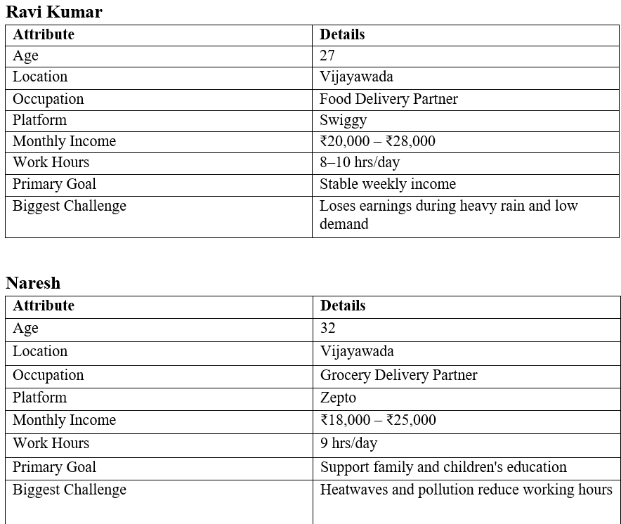

# Interview Insights
Insights were gathered from discussions with gig workers to understand the key problems they face in their daily work.

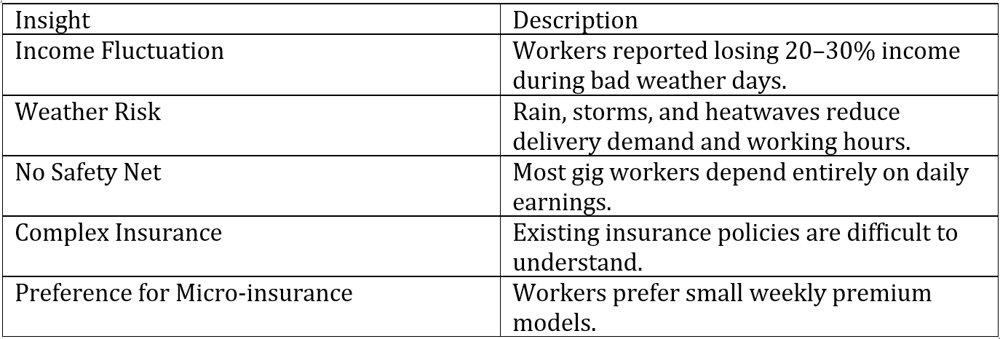

Worker Quotes:  
When it rains heavily, I cannot work and my earnings drop.   
If there was simple insurance protecting weekly income, I would use it.   
Insurance should be simple and automatic for gig workers.   

**Interview Insight Visuals (illustration placeholders):**
*   Illustration: Delivery worker facing heavy rain  
*   Illustration: Research interview with gig worker  
*   Illustration: Worker worried about unstable income

# Solution Concept

Our solution is an AI-powered parametric micro-insurance web application for delivery partners, using a 50 paise per-ride deduction to create an affordable weekly premium. It features zone-based policies that classify areas into Low-Risk and High-Risk Zones based on weather, flood, pollution, and traffic data, with each zone having its own premium, payout limits, and trigger conditions.

By integrating external APIs with AI-driven risk assessment, fraud detection, credibility scoring, and activity validation, the system automatically identifies genuine disruption events and enables fast, reliable payouts for eligible users, while remaining easily accessible and scalable through a web-based platform.

## Application Workflow
The delivery partner registers in the app, completes verification, and joins a low-cost weekly micro-insurance plan. The system monitors external disruptions in real time using APIs and AI. When a genuine event affects an active worker, the app validates the claim automatically and triggers a fast payout.

Visual Representation:

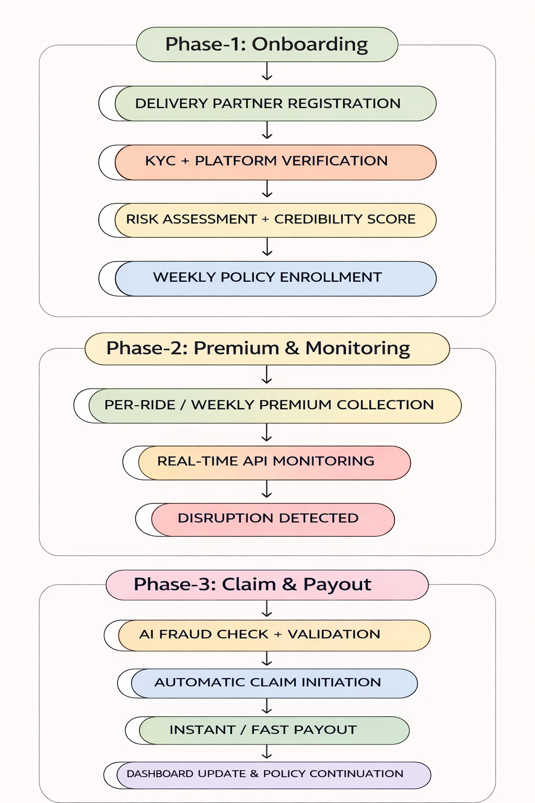

# Policy Design
Premiums are calculated using a per-ride deduction model, where a fixed amount is deducted from each completed delivery, making contributions proportional to rider activity. Higher-tier plans provide increased coverage, higher payout limits, and lower trigger thresholds, enabling quicker eligibility for payouts under defined conditions.

In high-risk zones, premiums follow a risk-adjusted structure to account for the higher probability of disruptions such as extreme weather or traffic conditions. The model remains activity-linked and zone-adjusted, ensuring balanced risk distribution, predictable payout exposure, and overall financial sustainability.

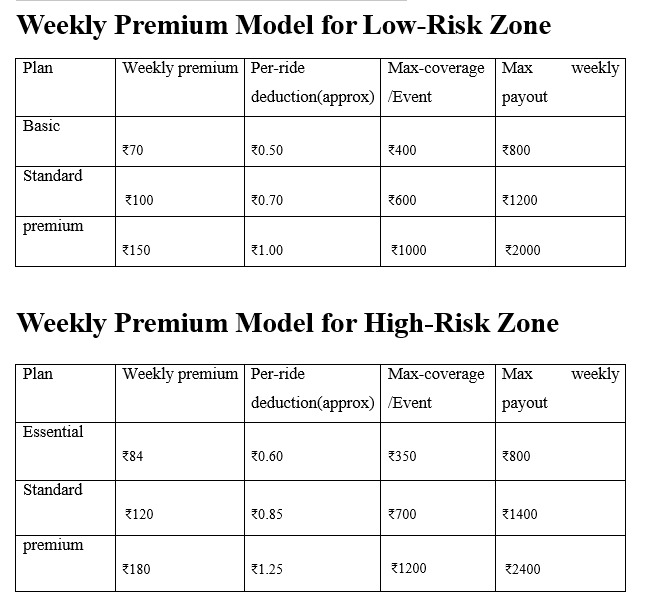

# Parametric Triggers

## Introduction
Parametric triggers are predefined conditions that automatically activate insurance payouts when a disruption occurs. Instead of relying on manual claim verification, payouts are determined using trusted external data sources such as weather conditions, pollution levels, or official government alerts. This approach enables faster, transparent, and efficient compensation for gig delivery workers affected by external disruptions.
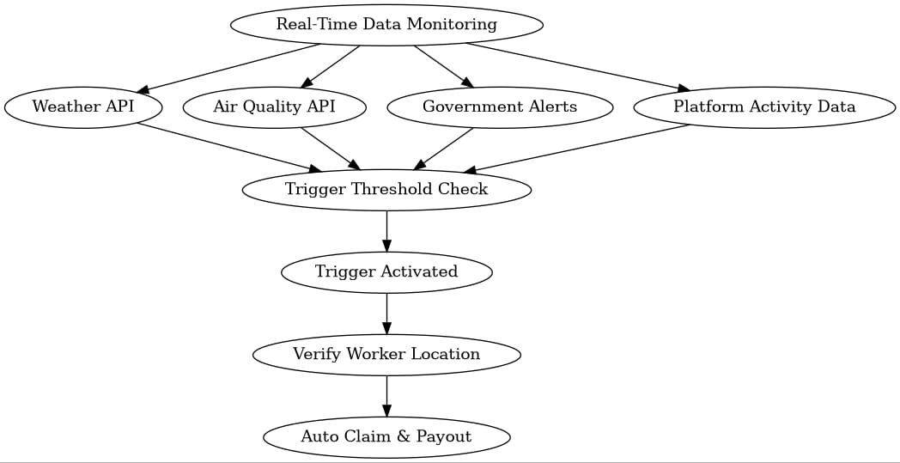

## Purpose of Parametric Triggers in the Platform
The objective of the platform is to protect gig delivery workers from income loss caused by events such as extreme weather, pollution, curfews, or delivery platform disruptions. When a trigger threshold is reached and eligibility conditions are satisfied, the system 
automatically processes compensation.

## Insurance Eligibility Parameters
These parameters determine whether a delivery worker is eligible for coverage in the 
system.  
• Active delivery partner account (Zomato/Swiggy/Blinkit/Zepto etc.)  
• Worker logged into the delivery platform during the disruption  
• Worker location within the affected delivery zone  
• Minimum weekly working hours requirement  
• Verified mobile device and GPS access  
• Valid UPI or payment method for payouts  
These parameters ensure that only active and genuine delivery workers are eligible for insurance protection.

## AI Risk Analysis Parameters
The AI system analyzes multiple factors to calculate risk levels and weekly premium 
pricing.  
• Historical weather disruptions in the delivery zone  
• Environmental risk levels such as pollution and heat conditions  
• Delivery demand patterns in the operating zone  
• Worker activity consistency on the platform  
• Past claim history of the worker  
• Probability of disruptions within a specific zone  
• Average income patterns of the worker  
• Delivery platform downtime frequency  
Based on these parameters, the AI model determines the risk score and dynamically adjusts the weekly premium amount.

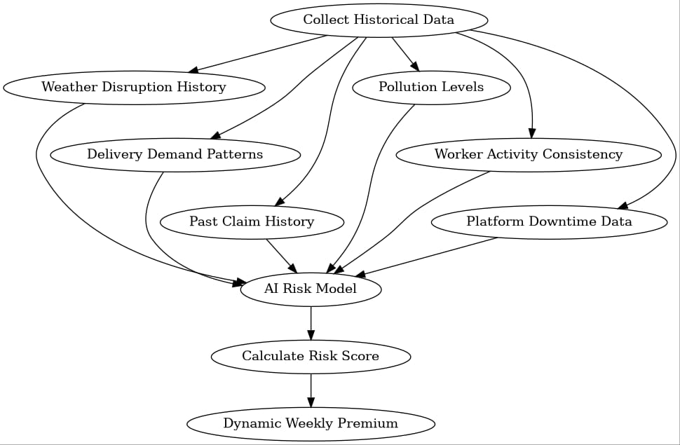

## Parametric Trigger Examples
Trigger thresholds are calibrated based on zone-level event frequency to balance responsiveness and financial sustainability. 

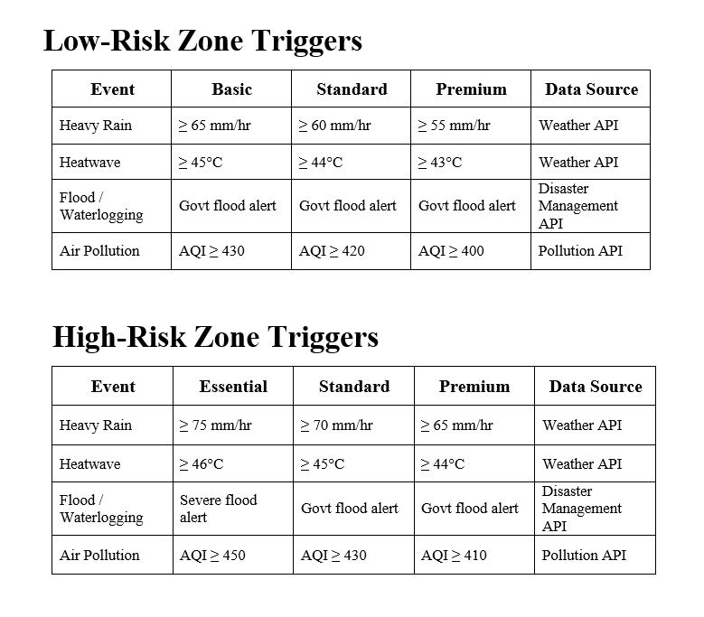

## How Parametric Triggers Work
The system continuously monitors environmental and platform data and automatically 
processes payouts when predefined trigger conditions are satisfied.  
• The platform collects real-time environmental and operational data through APIs.  
• The AI engine evaluates the incoming data against predefined trigger thresholds.  
• The system verifies the worker’s location and delivery platform activity.  
• The estimated income loss is calculated automatically.  
• The payout is released instantly through the integrated payment gateway.

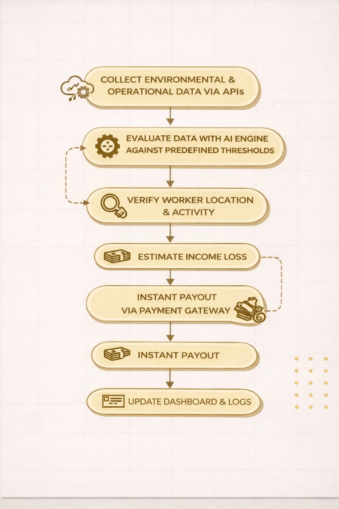

## Fraud Prevention and Detection Mechanisms
The platform incorporates multiple verification layers to detect and prevent fraudulent 
activity.  
• Verification using trusted external data sources such as weather and pollution APIs   
• GPS-based location validation within the affected zone  
• Verification of delivery platform activity during disruption periods  
• Duplicate claim detection using unique event identifiers  
• AI-based anomaly detection for suspicious claim patterns  
• Secure logging and audit trails for monitoring and investigation

.jpeg)

## Benefits of Parametric Triggers
Parametric triggers improve efficiency, transparency, and reliability in the insurance system.  
• Rapid automated payouts for eligible workers  
• Reduced fraud through verified external data sources  
• Clear and transparent trigger conditions  
• Scalable coverage for large numbers of delivery workers

## Insurance Architecture

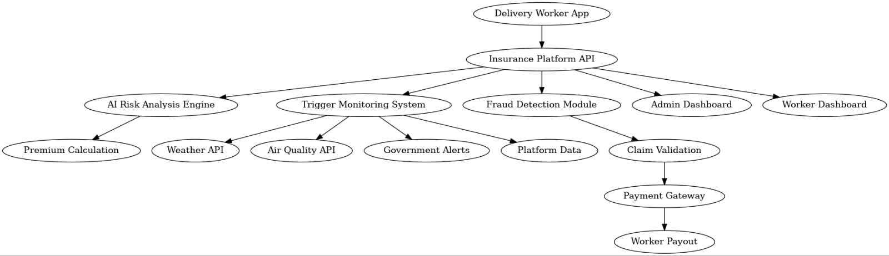

# System Architecture

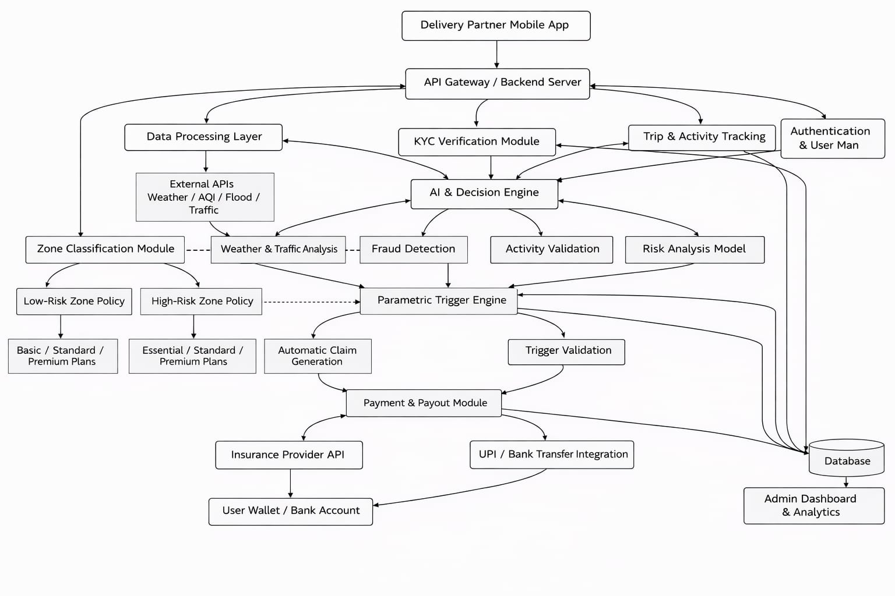

**Web Application**
Allows delivery workers to register, view coverage, track premiums, and receive payout notifications.
**Backend Server**
Handles authentication, policy management, premium calculation, and claim processing.
**AI Engine**
Analyzes environmental data and worker activity to calculate risk scores and detect fraud.
**External APIs**
Weather, air quality, and GPS data are used to monitor disruptions and validate worker location.
**Payment System**
Processes instant payouts through UPI or payment gateways.

# AI Integration

The platform uses AI to automate risk analysis, premium calculation, and fraud detection.
**Risk Scoring**
AI analyzes weather patterns, pollution levels, and disruption history to calculate a risk score for delivery zones.
**Dynamic Premium Calculation**
The system determines a weekly premium based on the risk score and worker activity.
**Disruption Monitoring**
Real-time environmental data such as rainfall, temperature, and AQI is monitored to detect delivery disruptions.
**Fraud Detection**
AI identifies suspicious activities like GPS spoofing, duplicate claims, or inactive workers requesting payouts.
**Automated Claim Trigger**
When a disruption threshold is reached and the worker is eligible, the claim is automatically triggered.

# Financial Model & Sustainability
## 1. Assumptions
Average deliveries per rider per day: 20  
Working days per week: 7  
Insurance type: Parametric micro-insurance (event-triggered payouts)

## 2. Premium Contribution
Low-Risk Zone (Basic Plan)  
Per delivery contribution: ₹0.50  
Weekly premium:  
₹0.50 × 20 × 7 = ₹70 per rider  

High-Risk Zone (Essential Plan)  
Per delivery contribution: ₹0.60

Weekly premium:  
₹0.60 × 20 × 7 = ₹84 per rider

## 3. Risk Pool Example
100 Low-Risk Riders (Basic)  
→ 100 × ₹70 = ₹7,000

50 High-Risk Riders (Essential)  
→ 50 × ₹84 = ₹4,200

## 4. Total Weekly Pool
Total Premium Collected = ₹11,200

## 5. Payout Structure
Low-Risk (Basic Plan)  
Max coverage per event: ₹400  
Max weekly payout per rider: ₹800  
Expected disruptions: 0–1 per week 

High-Risk (Essential Plan)  
Max coverage per event: ₹350  
Max weekly payout per rider: ₹800  
Expected disruptions: 1–2 per week  

## 6. Example Weekly Payout Scenario
10 affected low-risk riders  
→ 10 × ₹400 = ₹4,000

5 affected high-risk riders  
→ 5 × ₹350 = ₹1,750

## 7. Total Payout
Total Payout = ₹5,750

## 8. Financial Balance
Total Premium Collected: ₹11,200  
Total Payout: ₹5,750  
Remaining Buffer = ₹5,450

## 9. Sustainability Mechanism
The system maintains financial stability through:  
Pooled-risk model across all riders  
Lower payout per event in high-risk zones to offset higher frequency  
Parametric triggers to eliminate manual claims and reduce fraud  
Weekly payout caps to control excessive losses

# Tech Stack
## Web Application
 • 	Flutter  
 •	Dart
## Backend
 •	Node.js / Express or Python (FastAPI / Flask)  
 • Cloud Platforms (AWS)
## AI / Machine Learning
 •	Python  
 •	Scikit-learn  
 •	Pandas  
 •	NumPy
## Database
 •	Firebase / MongoDB / PostgreSQL
## APIs and Integrations
 •	OpenWeatherMap API  
 •	Air Quality API  
 •	Google Maps API  
 •	Payment Gateway APIs (Razorpay / Stripe sandbox)
## Security & Identity
 • KYC Verification (Blockchain-based identity systems)
## Payment Processing
 • Razorpay Sandbox API

# Development Roadmap

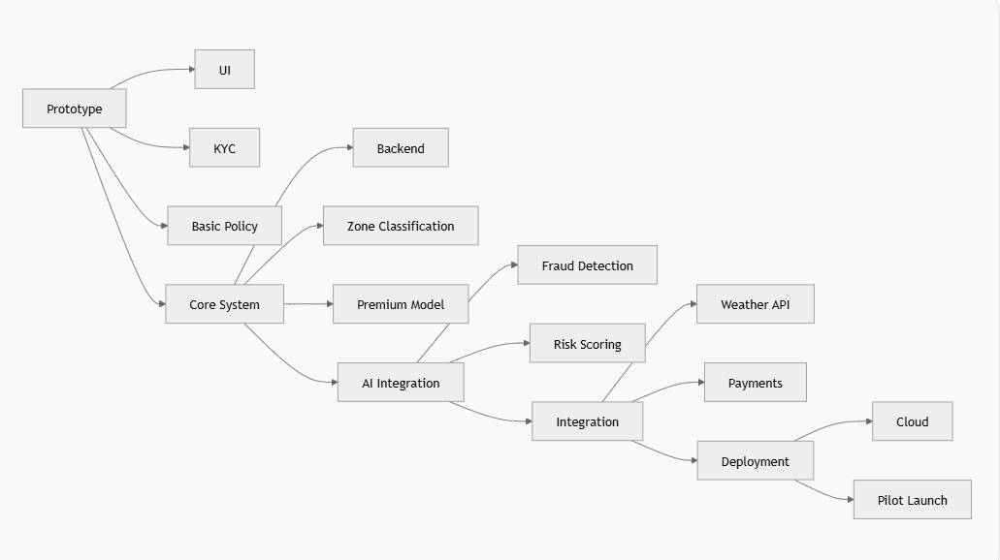

# Future Scope

Blockchain-based claim transparency for trust and auditability  
Dynamic pricing models using advanced AI based on real-time risk changes

